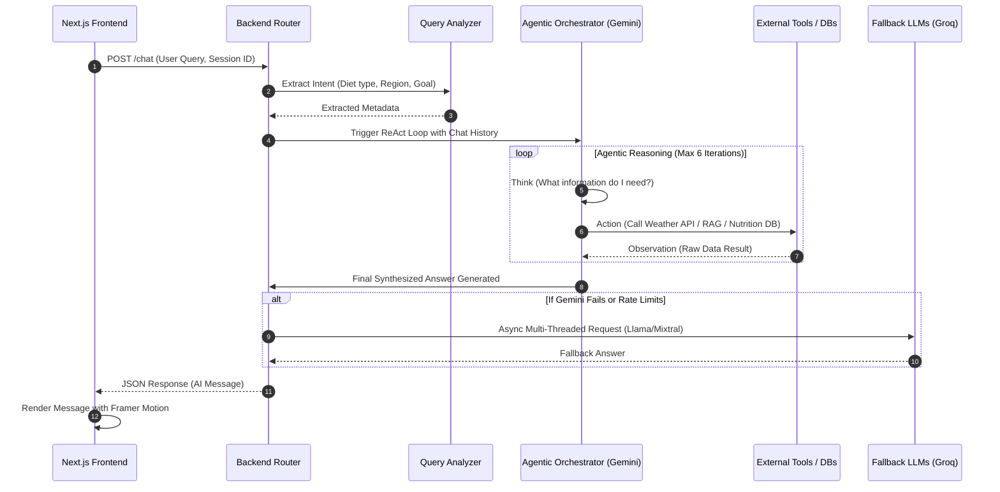

# 🥗 AAHAR: Advanced Assistant for Healthy Alimentary Recommendations
> **Comprehensive System Blueprint & Architectural Documentation**

This document serves as the absolute, complete technical blueprint for the **AAHAR** application. It details the technologies utilized, the system architecture, how the frontend and backend communicate, the theoretical foundations of the AI mechanics, and the exact purpose of every module within the codebase. 

Whether you are a new developer onboarding onto the project, a system architect reviewing the design choices, or a recruiter evaluating the technical depth of the system, this document provides a thorough explanation of "what," "how," and "why" AAHAR was built this way.

---

## 🏗️ 1. Executive Summary & Core Architecture

AAHAR operates on a decoupled client-server architecture. It is not just a "wrapper" over an LLM API; it is a sophisticated **Agentic System**. 
*   **The Client (Frontend):** A highly responsive, mobile-ready Progressive Web App (PWA) built in React/Next.js. It handles the user interface, animations, client-side data filtering, and local state management.
*   **The Server (Backend):** A heavily asynchronous Python/FastAPI backend acting as the "Brain." It hosts the conversational agent, manages the Retrieval-Augmented Generation (RAG) pipeline, interfaces with multiple external APIs, and ensures high availability through fallback Large Language Models (LLMs).

### 🔄 The End-to-End Data Flow



---

## 💻 2. Frontend Technology Deep Dive

Located in the `aahar_react` repository, the frontend is built to deliver a native-app-like experience in the browser.

### **Next.js 16 & React 19 (Turbopack)**
*   **The Theory:** Server-Side Rendering (SSR) and modern React paradigms allow for incredibly fast Time-To-Interactive (TTI) metrics.
*   **Application:** Next.js manages the routing structure (`/chat`, `/mess`, `/dashboard`). The new React 19 features ensure components re-render efficiently. Turbopack is used in development for instant Hot Module Replacement (HMR).

### **Framer Motion & Lucide React**
*   **The Theory:** Human perception of speed is heavily tied to visual feedback. AI generation takes time (sometimes 2-5 seconds). Stiff static loading screens cause user drop-off.
*   **Application:** `framer-motion` manages liquid-smooth transitions. The dynamic `<CalorieRing />` SVG animations and staggered chat bubble appearances keep the user subconsciously engaged while the backend processes complex tool-calls. `lucide-react` provides a crisp, consistent SVG iconography system.

### **Client-Side Data Offloading Strategy**
*   **The Problem:** The user needs to search through thousands of Indian food items. If we send an HTTP request to the backend for every keystroke, we will overload the server and the UI will feel laggy.
*   **The Solution:** The UI downloads a static copy of `nutrition_data.json` into the browser's memory. When the user types in the search bar, the filtering happens entirely on the client side using JavaScript. This results in **0ms network latency** for searches, creating a seamless user experience while drastically saving backend compute costs.

### **Mobile Readiness (Capacitor)**
*   **Application:** By integrating `@capacitor/android` and Firebase ecosystem bindings, AAHAR is not limited to the web. The UI is designed inside a mobile-friendly viewport structure, meaning the codebase can be compiled directly into a native `.apk` or `.ipa` for App Store deployment.

---

## 🚀 3. Backend Technology & Multi-Agent Deep Dive

The backend (`fastapi_app6.py` and the `app/` directory) is highly scalable and handles complex I/O operations concurrently.

### **FastAPI & ASGI**
*   **The Theory:** Traditional Python web frameworks (like Django or Flask) are synchronous (WSGI). If a request takes 5 seconds to get an answer from an LLM, the thread is blocked.
*   **Application:** FastAPI is built on Starlette and uses the Asynchronous Server Gateway Interface (ASGI). Because LLM calls, Database queries, and Web scraping are "I/O bound", using `async` and `await` allows the Uvicorn server to handle thousands of concurrent users on a single CPU core without freezing.

### **The Agentic Orchestrator (ReAct Paradigm)**
*   **The Theory:** Standard AI chatbots use "Zero-Shot Prompting" (they guess an answer immediately). AAHAR uses a **ReAct (Reason + Act)** agent architecture. The LLM is given a "Scratchpad" and a toolbox. It reasons about the user's prompt, decides which tool to use, executes it, reads the observation, and reasons again.
*   **Application:** If a user asks, *"Suggest a hot dinner for rainy weather in Delhi that is high in protein,"* the orchestrator's thought process is:
    1.  *Thought:* I need to know the weather in Delhi.
    2.  *Action:* Call `get_weather(city="Delhi")`.
    3.  *Observation:* It is raining and 22°C.
    4.  *Thought:* I need a database of high-protein Indian foods.
    5.  *Action:* Call `tool_lookup_nutrition_facts(query="high protein dinner")`.
    6.  *Observation:* Returns paneer, dal, chicken.
    7.  *Thought:* I have enough information to construct a culturally accurate, weather-appropriate response.

### **Groq LPUs & High Availability Fallbacks**
*   **The Problem:** Relying on a single AI provider (Google Gemini) creates a single point of failure. API rate limits or outages crash the app.
*   **The Solution:** An ultra-fast hardware inference engine (Groq) is integrated. If Gemini struggles, the system fires off concurrent background threads (using `ThreadPoolExecutor`) to **multiple models simultaneously** (Llama 3 70B, Mixtral 8x7B). It takes the fastest valid response and returns it, guaranteeing 99.9% uptime.

---

## 📚 4. Data & Knowledge Engines

AAHAR relies on two parallel databases to ensure accuracy: one for contextual knowledge (RAG) and one for deterministic mathematics (Nutrition DB).

### **Retrieval-Augmented Generation (RAG) & ChromaDB**
*   **The Theory:** LLMs suffer from "hallucinations" (making things up) because their knowledge is frozen in time. RAG solves this by converting text documents into multidimensional mathematical vectors (Embeddings). When a user asks a question, the system converts the question into a vector, finds the physically closest vectors in the database (Cosine Similarity), and forces the LLM to read those exact paragraphs before answering.
*   **Application:** AAHAR uses `ChromaDB` embedded locally and Google's `text-embedding-004` model. This allows the AI to reference exact Ayurvedic principles, complex dietary whitepapers, and specific regional eating habits rather than relying on its base training data.

### **Pandas & FuzzyWuzzy (Deterministic DB)**
*   **The Problem:** LLMs and Vector DBs suck at math. If you ask an LLM, "How many exact calories are in 123 grams of Dal Makhani?", it will likely guess wrong.
*   **The Solution:** A deterministic 1.3MB `nutrition_data.json` is loaded into a Pandas DataFrame in RAM.
*   **Fuzzy Searching:** Users misspell foods constantly. AAHAR uses the `FuzzyWuzzy` library to calculate the **Levenshtein Distance** (the minimum number of single-character edits required to change one word into the other). If a user searches "Dhal Makni", the system mathematically determines it is a 90% structural match to "Dal Makhani" and retrieves the exact, scientifically accurate calorie, protein, and macronutrient profile.

---

## 🌩️ 5. Cloud Deployment & Ephemeral Storage Strategy

Cloud platforms like **Render**, **Heroku**, or AWS Elastic Beanstalk use *Ephemeral Storage*. Every time the server scales up or reboots, files saved to the local disk are permanently deleted.

*   **The Challenge:** The heavy ChromaDB vector database is too large to store in the GitHub repository. It must be downloaded when the server starts. However, downloading a multi-megabyte zip file from HuggingFace on a cloud server often fails due to bot-detection (`403 Forbidden`) or network timeouts, leaving a corrupted, half-finished zip file that crashes the app.
*   **The Engineering Fix:** 
    1.  The `app/vector_store.py` logic injects a custom `User-Agent: Mozilla/5.0` header into the HTTP request so HuggingFace treats the server like a real browser.
    2.  It implements strict corruption checks (`zipfile.BadZipFile`).
    3.  If a download timeout occurs, it actively **deletes the corrupted archive** from the OS cache before throwing an error, ensuring that the next time the system attempts to boot, it starts from a clean slate rather than crashing repeatedly on a broken file.

---

## 📂 6. Modular Codebase Architecture

As the application grew beyond 3,000 lines, maintaining a monolithic `fastapi_app.py` became unscalable. The backend was surgically refactored into a highly modular **FastAPI Router Pattern**. This ensures isolation of concerns, easier bug tracking, and prevents merge conflicts.

```text
Diet_Suggest_AAHAR/
├── fastapi_app6.py         # 🚀 Main App Entrypoint
│                           # Boots Uvicorn, initializes globals, includes API routers.
│
├── app/                    # 📦 Core Modular Package
│   ├── api/                # 🌐 Web Endpoints (The "Controllers")
│   │   ├── chat.py         # -> POST /chat: Houses the entire Agentic LangChain Loop.
│   │   ├── meal_analysis.py# -> POST /analyze-meal: Maps dish names to nutrition data & gets AI summary.
│   │   ├── nutrition.py    # -> GET /nutrition/...: Direct REST endpoints exposing the local DB.
│   │   └── utilities.py    # -> GET /health: Detailed server component status and analytics.
│   │
│   ├── core/               
│   │   └── globals.py      # 🌍 Shared AppState. Centralizes memory for DB instances and LLM connections.
│   │
│   ├── ai/                 # 🧠 Intelligence Logic
│   │   ├── agent_tools.py  # Definitions for the tools the LLM can use (@tool decorators).
│   │   ├── groq.py         # Multi-threaded Fallback logic bypassing standard chains.
│   │   ├── llm_chains.py   # Langchain QA memory wrappers, Prompt templates, and SafeTracer setup.
│   │   └── prompts.py      # The massive System Prompts defining the AI's persona and ruleset.
│   │
│   ├── database/           # �️ Data Management
│   │   ├── nutrition_search.py # Pandas filtering, FuzzyWuzzy matching, and dataset loading hooks.
│   │   └── vector_store.py # Logic to download the HuggingFace db.zip & initialize Chroma securely.
│   │
│   ├── query_analysis.py   # 🔍 NLP helper functions (Regex & Keyword mapping) to detect goals early.
│   └── models.py           # 📋 Pydantic Schemas enforcing strict type hints for JSON requests/responses.
```

## 🔮 7. Future Scope & Scalability

The current architecture is **Stateless** (session memory is stored on the client or in lightweight RAM structures linked by an HTTP Token). This means AAHAR is ready to scale horizontally behind a load balancer (like AWS Application Load Balancer or NGINX) across dozens of worker nodes without fear of state corruption.

**Immediate Next Steps:**
1.  **Persistent User Auth:** Implementing JWT / PostgreSQL to save user diet histories permanently.
2.  **Multimodal Vision:** Allowing users to upload a photo of an Indian Thali, utilizing Gemini Vision Pro to identify the dishes and trigger the backend `analyze-meal` pipeline automatically.

---
*Architectural Blueprint generated by the AAHAR Engineering Team.*
