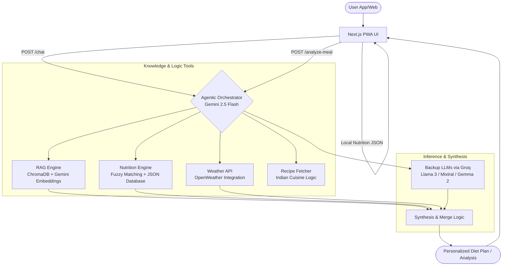

# 🥗 AI Diet Suggestion System (Indian Edition) - AAHAR

> **AAHAR** (Advanced Assistant for Healthy Alimentary Recommendations) is a highly sophisticated, context-aware AI agent designed to navigate the complex landscape of Indian dietary habits. It leverages an Agentic RAG pipeline to provide culturally relevant, nutritionally grounded, and environmentally aware food advice.


---

## 📸 Project Overview

**AAHAR** intelligently provides regionally-aware and dietary-type-specific Indian food suggestions using a RAG (Retrieval-Augmented Generation) pipeline, conversational memory, and fallback LLM integrations via Groq.

It understands queries like:
> *"Suggest a South Indian vegetarian dinner plan for diabetes."*
> *"What is the nutritional difference between Dal Makhani and Mixed Dal?"*
> *"Analyze my meal: 2 Rotis, 1 cup of Chana Masala, and a bowl of curd."*

---

## 📸 Architectural Workflow



---

## 🧠 Core Intelligence Features

### 1. Agentic Orchestration Loop
Unlike standard chatbots, AAHAR uses a self-correcting **6-iteration agent loop**. The orchestrator (Gemini 2.5 Flash) analyzes the query, selects the appropriate tool (Weather, RAG, Nutrition Fact, or Recipe), observes the output in a scratchpad, and iteratively refines its response until it meets the user's specific goals.

### 2. Multi-Tier Nutrition Search Engine
The system employs a sophisticated search strategy for its 1.3MB Indian food database:
*   **Tier 1 (Exact):** Direct mapping for common dishes.
*   **Tier 2 (Regex/Substring):** Identifies variations within category names.
*   **Tier 3 (Fuzzy Logic):** Powered by `fuzzywuzzy` with a token-set ratio scorer (>85 threshold) to handle typos like "Paneer Tika" vs "Paneer Tikka."

### 3. Integrated Meal Analyzer
The `/analyze-meal` engine provides professional-grade nutritional critiques:
*   **Numeric Aggregation:** Calculates exact totals for Calories, Protein, Carbs, Sugar, Fats, Fiber, and Sodium from a list of consumed dishes.
*   **AI Critique:** Gemini analyzes the aggregated totals to provide a 3-5 sentence professional assessment of the meal's balance, caloric density, and health suitability.

### 4. Hyper-Local Cultural Awareness
The system's metadata extraction engine is tuned for the Indian subcontinent:
*   **Regions:** Maps cities to specific cuisines (e.g., Patna -> **Bihari**, Lucknow -> **Awadhi**, Kolkata -> **Bengali**).
*   **Goals:** Understands the difference between "bulking," "clean bulking," "shredding," and "belly fat reduction."
*   **Weather Awareness:** Automatically fetches real-time data to suggest **cooling foods** in heatwaves or **warming meals** during winters.

---

## 🛠 Tech Stack

| Component         | Tool                                              |
| ----------------- | ------------------------------------------------- |
| **Brain**         | Google Gemini 2.5 Flash (Live)                    |
| **Inference Path**| LangChain Agentic Orchestrator                    |
| **Fallback LLMs** | Groq (Llama 3 70B, Mixtral 8x7B, Gemma 2 9B)      |
| **Vector DB**     | ChromaDB with `text-embedding-004` (Gemini)       |
| **Frontend UI**   | React 19, Next.js 16 (PWA-enabled), Framer Motion |
| **Backend App**   | FastAPI with Uvicorn                              |
| **Logic Props**   | Pandas, FuzzyWuzzy, OpenWeather API               |

---

## 📂 Project Structure

| File                  | Role                                                                         |
| --------------------- | ---------------------------------------------------------------------------- |
| `fastapi_app5.py`     | The "Brain" - Contains the Agentic Orchestrator, tool definitions, and API logic. |
| `llm_chains.py`       | Core LangChain logic: RAG pipelines, Prompt Templates, and History management. |
| `nutrition_data.json` | 1.3MB + Database of detailed nutritional profiles for Indian dishes.            |
| `groq_integration.py` | Multi-threaded handler for fallback LLMs (Llama, Mixtral, Gemma).             |
| `query_analysis.py`   | NLP module for extracting dietary preferences, regions, and user sentiment.    |
| `weather.py`          | Real-time environment integration via OpenWeather API.                        |

---

## � Output Types & Features

*   ✅ **Plain-text Answer:** Direct, concise nutritional advice.
*   ✅ **Merged Responses:** Intelligent blending of Gemini and Groq (fallback) data.
*   ✅ **Tabular Format:** Markdown tables for meal plans (Meal, Food, Calories, Nutrients).
*   ✅ **Meal Logs:** Aggregated nutritional summaries for multiple dishes.
*   ✅ **Sentiment Detection:** Adjusts tone based on user positivity or frustration.

---

## 🚀 Deployment & Usage

### 🔧 Setup
```bash
# Clone and navigate
git clone https://github.com/DYNOSuprovo/Diet_Suggest_AAHAR.git
cd Diet_Suggest_AAHAR

# Install dependencies
pip install -r requirements.txt
```

### 🔑 Environment Configuration
Create a `.env` file or export variables:
```bash
export GEMINI_API_KEY="your_key"
export GROQ_API_KEY="your_key"
export OPENWEATHER_API_KEY="your_key"
```

### 🥪 Running the App
```bash
# Start the Backend
uvicorn fastapi_app5:app --host 0.0.0.0 --port 10000

# Start the Streamlit UI (Optional)
streamlit run streamlit_ui.py
```

---

## 🚧 Future Road Map
*   � **Mobile App:** Flutter-based frontend for pocket-access.
*   📊 **PDF Exports:** Generating professional PDF diet charts for users.
*   🔔 **Reminders:** Native notifications for meal times and hydration.
*   🤖 **Bot Integration:** Telegram and WhatsApp integration for low-latency queries.
*   📈 **Vision Support:** Analyzing food images to estimate portion sizes.

---

## �🙏 Acknowledgements
*   Created with ❤️ by **Suprovo** (Lord d'Artagnan).
*   [LangChain](https://github.com/langchain-ai/langchain) for the orchestration framework.
*   [Google AI](https://ai.google.dev/) for the Gemini 2.5 Flash capabilities.
*   [Groq API](https://console.groq.com/) for ultra-fast fallback inference.
*   [OpenWeather](https://openweathermap.org/) for environmental context.

---

## 📜 License
MIT License — Fork it, improve it, contribute!
